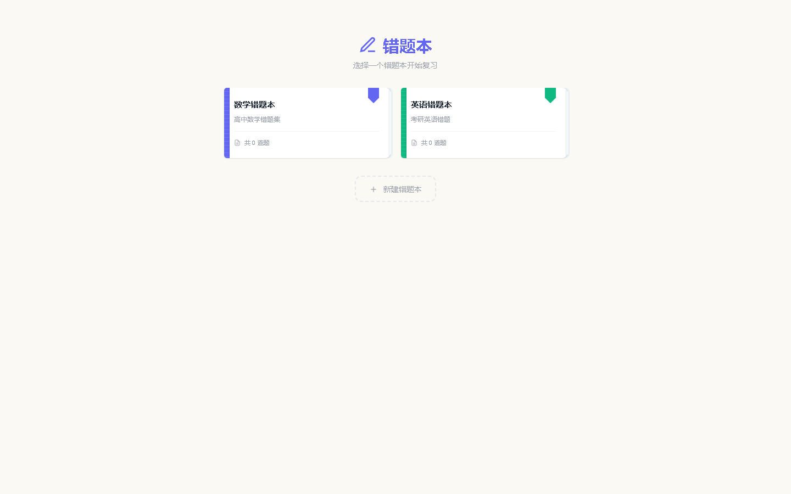

# 错题本 (CuoTiBen)

智能错题管理工具 —— 记录错题、对比答案、高效复习。


<p align="center">
  
  
</p>

---

## 功能概览

- **多错题本管理** — 创建多个独立错题本，支持拖拽排序和搜索过滤
- **富文本编辑器** — 支持 Markdown、图片粘贴/拖拽/截图/拍照，内容实时自动保存
- **间隔重复复习 (SRS)** — 基于 SM-2 算法的科学复习系统，自动安排复习计划
- **画笔批注** — Canvas 画笔标注，支持多色、橡皮擦、撤销/重做
- **学科与标签** — 自定义学科分类和颜色标签，便于筛选归类
- **批量操作** — 批量选择、删除、导出、打标签
- **数据统计** — 学科分布、复习活跃度、掌握程度可视化
- **导入导出** — 支持 JSON 数据导入导出、PDF 打印
- **深色模式** — 手动切换或跟随系统
- **崩溃恢复** — 每秒自动快照，防止数据丢失
- **键盘快捷键** — 完整的键盘操作支持
- **PWA 离线支持** — Service Worker 缓存优先策略，离线可用

完整功能列表见 [FEATURES.md](./FEATURES.md)。

## 技术栈

| 层级     | 技术                                         |
| -------- | -------------------------------------------- |
| 前端框架 | Vue 3 (Composition API, `<script setup>`)    |
| 类型系统 | TypeScript (strict mode)                     |
| 样式方案 | Tailwind CSS 3.4 (dark mode)                 |
| 构建工具 | Vite 6                                       |
| 桌面壳   | Electron 42                                  |
| 数据存储 | Electron: 本地 JSON 文件 / 浏览器: IndexedDB |
| 安全消毒 | DOMPurify + marked                           |

## 快速开始

### 环境要求

- Node.js ≥ 18
- npm ≥ 9

### 开发

```bash
# 安装依赖
npm install

# 启动 Vite 开发服务器
npx vite

# 启动 Electron 桌面应用（需先 build 前端）
npx vite build && npx electron .
```

### 构建

```bash
# Windows NSIS 安装包
npm run build:win:installer

# 手动构建其他平台
npx vite build && electron-builder --mac    # macOS DMG
npx vite build && electron-builder --linux  # Linux AppImage / deb
```

构建产物输出在 `dist-electron/` 目录。

## 项目结构

```
notes-app/
├── electron/            # Electron 主进程 & preload
│   ├── main.cjs         # IPC 处理、文件存储
│   └── preload.cjs      # 安全上下文桥接
├── src/
│   ├── components/      # Vue 组件（21 个）
│   ├── composables/     # 业务逻辑 hooks（12 个）
│   ├── services/        # 数据访问层（双后端：Electron + IndexedDB）
│   ├── types/           # TypeScript 类型定义
│   └── utils/           # Markdown 渲染、HTML 消毒
├── public/              # 静态资源（图标、PWA manifest）
├── patches/             # patch-package 补丁
├── FEATURES.md          # 完整功能文档
├── sw.js                # Service Worker
└── vite.config.ts       # Vite 配置
```

## 测试

项目包含 Playwright (Python) 端到端测试脚本：

```bash
# 启动开发服务器后运行
npx vite &
python test_notebooks.py
python test_ebb.py
python test_save.py
python test_unreviewed.py
```

## 许可证

MIT © Nie Yulong (聂昱龙)
